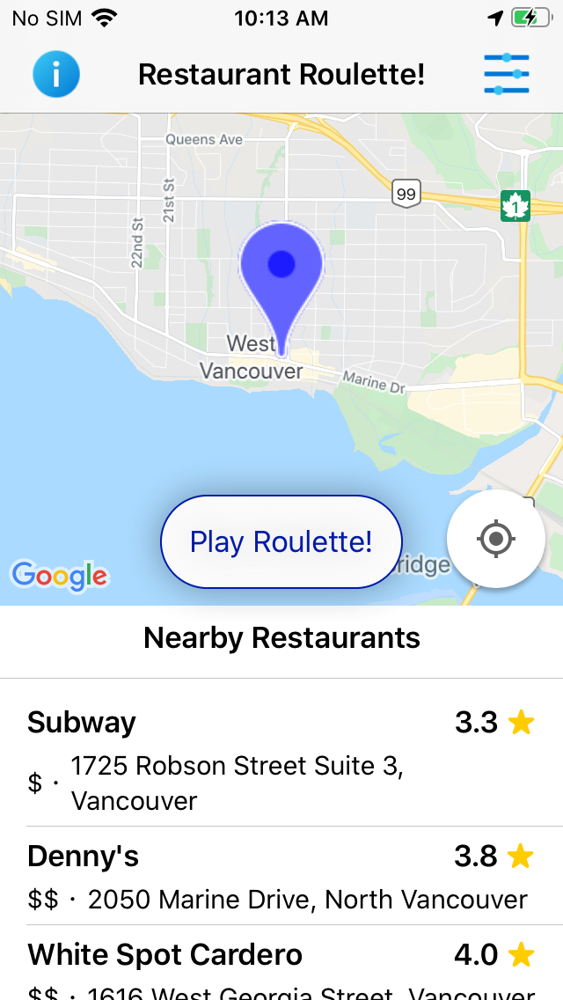
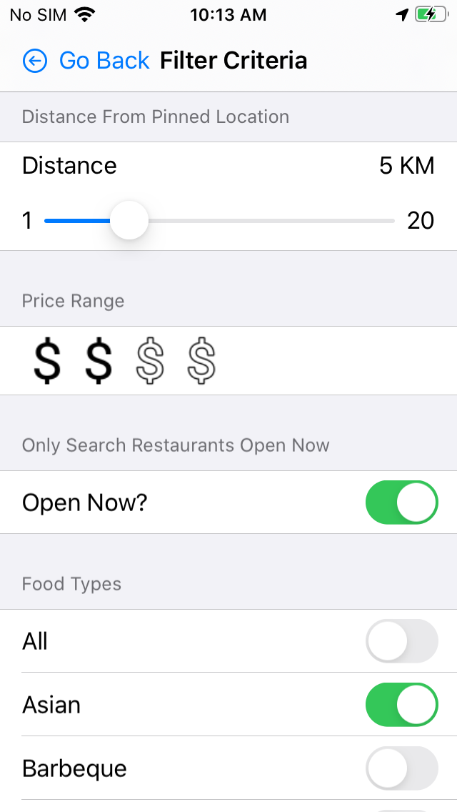
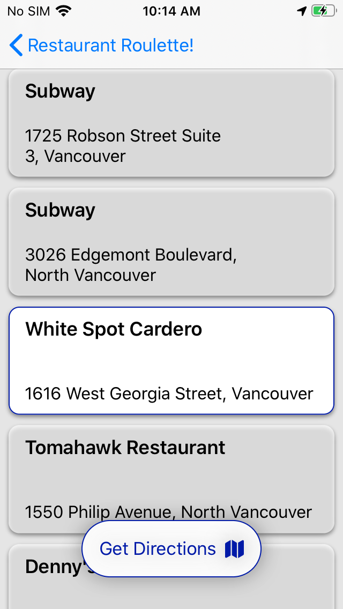

# RestaurantRoulette
Food finder iOS app that utilizes Google Maps API to find places to eat nearby that match a set of filter criteria. The app will randomly select a place to eat and link to the directions.

## Screenshots
  

## Motivation 
Wanted an easy way to choose a place to eat nearby or in a specific area.

## Features
* A map that defaults to the user’s location and displays a list of all nearby restaurants
* The list includes the restaurant’s name, address, rating and price point from Google Maps Nearby Search API
* Option to choose a different location to search for nearby restaurants by moving the marker on the map
* Option to filter the restaurants that will appear by setting the distance from the marker, the price range, selecting only restaurants that are currently open, and filtering the food type
* The “Play Roulette!” button will spin through all restaurants in the list and choose one at random

## Challenges
* Had some issues when running many Google Maps Nearby Search queries when multiple filters were applied. Had to synchronize the calls using the Dispatch Group.
* Had some difficulty getting the marker on the map to default to the user’s location.

## Things I Learned
* Utilized CocoaPods to get the Google Maps SDK for iOS
* Synchronized all calls fetching data from the Google Maps API, this way all data is loaded into the list at the same time 

## Future Improvements
* Add a link for each restaurant in the list to get detailed information on the restaurant from Google Maps 
* Add an option to remove a restaurant from the list before spinning to choose a random restaurant

